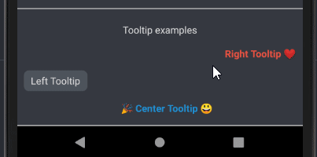
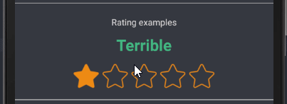
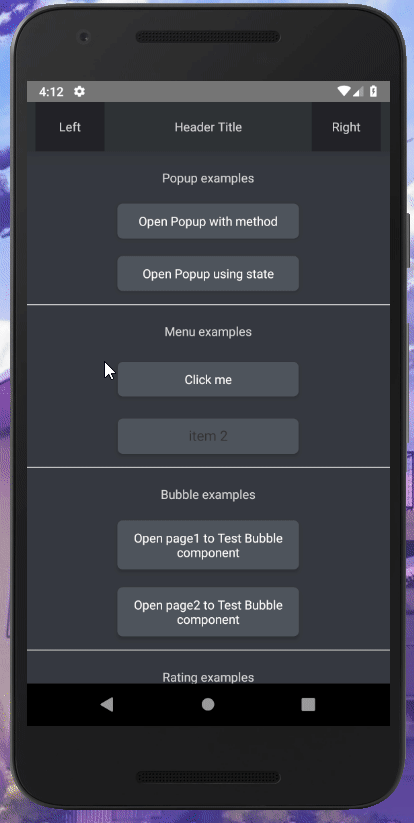
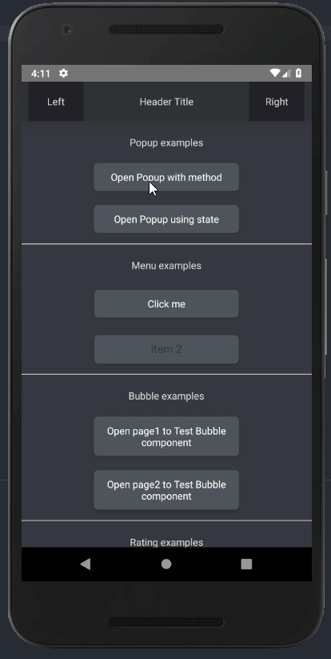
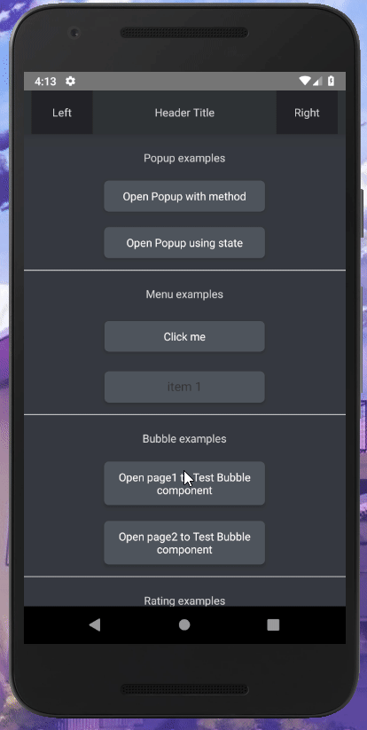

# Some info
Bunch of components made for react-native to give more ability to have some nice features.
I didn't want to release this as I wanted to have much more components than it has right now, but couldn't wait since I wanted to use it for my own projects as well.
(I will make a better documentation page, probably will be adding them in wiki or make a proper doc website for easier usage.)

# Components

- [Header](#Header)
- [ProgressiveImage](#ProgressiveImage)
- [Divider](#Divider)
- [Triangle](#Triangle)
- [Tooltip](#Tooltips) (with preview)
- [Rating](#Rating) (with preview)
- [Menu](#Menu) (with preview)
- [Popup](#Popup) (with preview)
- [Bubble](#Bubble) (with preview)


# Example

## Header

### Usage: 
```js
import { Header } from "react-native-ui-tools";

<Header
    leftComponent={
        <View style={{
            flex: 1,
            backgroundColor: '#202225',
            justifyContent: 'center',
            alignItems: 'center',
            width: '100%'
        }}>
            <Text style={{ color: '#D7D5D9' }}>Left</Text>
        </View>
    }
    rightComponent={
        <View style={{
            flex: 1,
            backgroundColor: '#202225',
            justifyContent: 'center',
            alignItems: 'center',
            width: '100%'
        }}>
            <Text style={{ color: '#D7D5D9' }}>Right</Text>
        </View>
    }
    centerComponent={
        <Text style={{ color: '#D7D5D9' }}>Header Title</Text>
    }
    style={{ elevation: 16, backgroundColor: '#2F3136', borderBottomWidth: 0 }}
/>
```

----------

## ProgressiveImage

### Usage: 
```js
import { ProgressiveImage } from "react-native-ui-tools";

<ProgressiveImage 
    source={{uri: 'https://link.to/your/image.png'}} // URL to your main image
    defaulImage={require('defaultImageBeforeIsLoadingFinished.png')} // loads before your image starts loading and will be gone when loading is done on success or error
    errorImage={{uri: 'error.png'}} // if loading main image fails, this will show up
/>
```

-----------

## Divider

### Usage:
```js
<Divider color='#ccc' style={{ marginTop: 15 }} />
```

-----------

## Triangle
```js
<Triangle
  style={{ borderBottomColor: '#f00' }}
  isDown={true}
/>
```

### Usage:
```js
<Divider color='#ccc' style={{ marginTop: 15 }} />
```

-----------

## Tooltips

### Usage: 
```js
import { Tooltip } from "react-native-ui-tools";

<Tooltip popover={<Text>Tooltip info here</Text>}>
    <Text style={{ color: '#1D8CCF', fontWeight: 'bold' }}>🎉 Center Tooltip 😃</Text>
</Tooltip>
```

### Preview 


------------

## Rating

### Usage: 
```js
import { Rating } from "react-native-ui-tools";

<Rating
    starColor='#ED8A19'
    reviewColor='#43B581'
/>
```

### Preview 


------------

## Menu

### Usage: 
```js
import { Menu } from "react-native-ui-tools";

menuData = [
    { number: 0, label: "item 1" },
    { number: 1, label: "item 2" },
    { number: 2, label: "item 3" },
    { number: 3, label: "item 4" },
    { number: 4, label: "item 5" },
    { number: 5, label: "item 6" }
];
menuData2 = [
    { id: 0, name: "item 1" },
    { id: 1, name: "item 2" },
    { id: 2, name: "item 3" },
    { id: 3, name: "item 4" },
    { id: 4, name: "item 5" },
    { id: 5, name: "item 6" }
];

<Menu
    data={this.menuData}
    keyExtractor={item => item.number}
    labelExtractor={item => item.label}
    onChange={(item) => alert(JSON.stringify(item))}
>
    <View
        style={{ width: 205, padding: 10, backgroundColor: '#4F545C', elevation: 4, borderRadius: 6 }}
    >
        <Text style={{ textAlign: 'center', color: 'white' }}>Click me</Text>
    </View>
</Menu>

<Menu
    data={this.menuData2}
/>
```

### Preview 


----------

## Popup

### Usage: 
```js
import { Popup } from "react-native-ui-tools";

this.state = {
    popup: false // for second example that can be closed or opened by changing this state
}

this.popup = null; // to store reference of first popup example


renderPopupToggle(text, onPress) {
    return (
        <View style={{ width: '100%', justifyContent: 'center', alignItems: 'center', marginTop: 20 }}>
            <TouchableOpacity
                style={{ width: '50%', padding: 10, backgroundColor: '#4F545C', elevation: 4, borderRadius: 6 }}
                onPress={() => {
                    onPress();
                }}
            >
                <Text style={{ textAlign: 'center', color: 'white' }}>{text}</Text>
            </TouchableOpacity>
        </View>
    )
}

// with custom components for center, header and footer
<Popup
    ref={(ref) => this.popup = ref}
    headerComponent={
        <View style={{ flex: 0.5, backgroundColor: '#ccc', width: '100%', justifyContent: 'center', alignItems: 'center' }}>
            <Text style={{ fontWeight: 'bold' }}>my own custom header</Text>
        </View>
    }
    contentComponent={
        <View style={{ flex: 1, backgroundColor: '#006600', width: '100%', padding: '8%' }}>
            <Text style={{ color: 'white' }}>Some text andd info here, here we go... can be some questions?</Text>
        </View>
    }
    footerComponent={
        <View style={{ flex: 0.5, backgroundColor: 'green', width: '100%', flexDirection: 'row', justifyContent: 'space-around', alignItems: 'center' }}>
            <TouchableOpacity
                style={{ width: '25%', height: '80%', backgroundColor: 'white', justifyContent: 'center', alignItems: 'center', elevation: 8, borderRadius: 20 }}
                onPress={() => alert("Pressed button1")}
            >
                <Text>Button1</Text>
            </TouchableOpacity>
            <TouchableOpacity
                style={{ width: '25%', height: '80%', backgroundColor: 'white', justifyContent: 'center', alignItems: 'center', elevation: 8, borderRadius: 20 }}
                onPress={() => alert("Pressed button2")}
            >
                <Text>Button2</Text>
            </TouchableOpacity>
        </View>
    }
/>

// no custom components
<Popup
    onClose={() => {
        this.setState({ popup: false })
        return true;
    }}
    visible={this.state.popup}
    title={"Just a title"}
    content={"This is just a message wrapped in a popup component, let's make it bigger:\n\nLorem ipsum dolor sit amet, consectetur adipiscing elit, sed do eiusmod tempor incididunt ut labore et dolore magna aliqua. Ut enim ad minim veniam, quis nostrud exercitation ullamco laboris nisi ut aliquip ex ea commodo consequat. Duis aute irure dolor in reprehenderit in voluptate velit esse cillum dolore eu fugiat nulla pariatur. Excepteur sint occaecat cupidatat non proident, sunt in culpa qui officia deserunt mollit anim id est laborum."}
/>

{this.renderPopupToggle('Open Popup with method', () => this.popup.show())}
{this.renderPopupToggle('Open Popup using state', () => this.setState({ popup: true }))}
```

### Preview 


------------

## Bubble

### Usage: 
```js
import { Bubble } from "react-native-ui-tools";

<Bubble>
    <Text>This is how Bubble looks like</Text>
    <Text>Test Test Test</Text>
    <Text>This is working...</Text>
</Bubble>
```

### Preview 

